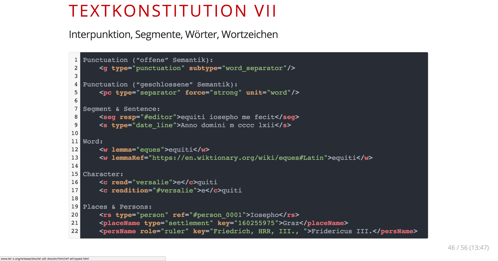
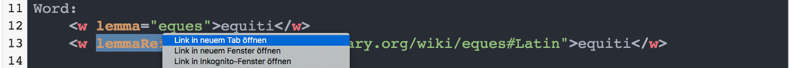
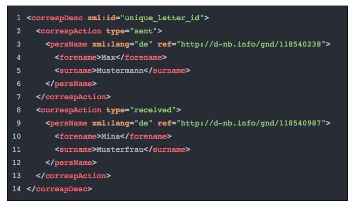

# tei-doc-link

<!-- TOC START min:1 max:3 link:true update:true -->
- [tei-doc-link](#tei-doc-link)
  - [TEI Documentation Links](#tei-documentation-links)
  - [Usage](#usage)
    - [Overview](#overview)
    - [Query selector options](#query-selector-options)
    - [Language options](#language-options)
    - [What elements and attributes will be linked?](#what-elements-and-attributes-will-be-linked)
    - [Examples](#examples)
  - [To Do](#to-do)
  - [License](#license)

<!-- TOC END -->


## TEI Documentation Links
Provides automatic linking of element and attribute names in code snippets to their respective page within the TEI-P5-XML documentation using JavaScript.

Tested with [Impress.js](https://github.com/impress/impress.js/) and  [Highlight.js](http://idodev.co.uk/2013/03/syntax-highlighting-with-highlightjs/) (propably needs some css fine tuning depending on your other packages).

Also works, of course, in the context of “normal” web pages, e.g. see live demo [here](https://hou2zi0.github.io/tei-doc-link/examples/example.html).

It also provides a simple CSS stylesheet to mimic the Atom dark theme. The classes used by the CSS are applied by JavaScript and are as follows:

* `span.delimiters`
* `span.element`
* `span.attribute`
* `span.value`
* `span.comment-string`
* `a.tei-doc-link`
* `code.xml.tei-doc-link`

When `lineNumbering` is set to `true`, the following markup applies as well:

* `span.line-numbering`
* `span.code-line`

N.B.: Third party libraries may provide their own markup and classes. Thus there’s a possibility that the CSS gets scrambled, when too many libraries work on the codes snippets.

N.b.: The file in the `JS` folder is going to be (mostly) stable. Development work will be carried out in `dev`.

## Usage
### Overview
Include the JavaScript file at the bottom of your HTML page.  Just before that, you may provide the class names of the code snippets, where you want to link to the TEI documentation in the constant variable `TEI_DOC_LINK` .

N.b.: by default the CSS and the JS files
* expect the classes `xml tei-doc-link` on the element `<code>`
* and apply the `document.getElementsByClassName()` selector method.

When `TEI_DOC_LINK` is not provided, it will be  set as `xml tei-doc-link` automatically. You may switch to the `document.querySelectorAll()` selector method by setting the `querySelectorAll` property in `TEI_DOC_LINK_CONFIG` to `true` (see below). When you switch the selector method, you must also provide a valid query in `TEI_DOC_LINK`, e.g. `pre code.xml.highlight`.

```html
<html>
  <head>
    <link rel="stylesheet" href="https://hou2zi0.github.io/tei-doc-link/CSS/tei-documentation-links.css" />
  </head>
  <body>
    <pre><code class="xml tei-doc-link">&lt;gap reason="ellipsis"/&gt;</code></pre>
  […]
    <script>
      const TEI_DOC_LINK = `xml tei-doc-link`;
      const TEI_DOC_LINK_CONFIG = {
        "querySelectorAll": false,
        "language": "english",
        "lineNumbering": true
      }
    </script>
      <script type="text/javascript" src="https://hou2zi0.github.io/tei-doc-link/JS/tei-documentation-links.js"></script>
  </body>
</html>
```

### Query selector options

To switch to the `document.querySelectorAll()` selector method set `TEI_DOC_LINK_CONFIG.querySelectorAll = true`. Don’t forget to provide a valid query, e.g. `pre code.xml.highlight`.

```html
<script>
  const TEI_DOC_LINK = `pre code.xml.highlight`;
  const TEI_DOC_LINK_CONFIG = {
    "querySelectorAll": true
  }
</script>
```

### Language options

You may change the localization of the linked documentation by setting the `TEI_DOC_LINK_CONFIG.language = "en"` to a valid value indicating the target language (for possible values see below).

```html
<script>
  const TEI_DOC_LINK = `pre code.xml.highlight`;
  const TEI_DOC_LINK_CONFIG = {
    "language": "english",
  }
</script>
```

Possible values for `TEI_DOC_LINK_CONFIG.language` are as follows:

* `en` or `english` for English.
* `de` or `german` for German.
* `es` or `spanish` for Spanish.
* `it` or `italian` for Italian.
* `fr` or `french` for French.
* `ja` or `japanese` for Japanese.
* `ko` or `korean` for Korean.
* `zh-TW` or `traditional chinese` for traditional Chinese characters.


### What elements and attributes will be linked?

Every element name recognized as such by the regular expression will be linked to its assumed TEI documentation page, regardless of its actual existence.

Attribute names will be linked, if they are part of the following dictionaries. The first and larger dictionary will for the most part provide links to the more general attribute description pages within the documentation. The second dictionary will provide links to the more specific attribute description within an element’s description page.

General lookup dictionary:

```javascript
{
  "type": "att.typed",
  "subtype": "att.typed",
  "xml:id": "att.global",
  "xml:lang": "att.global",
  "n": "att.global",
  "key": "att.canonical",
  "ref": "att.canonical",
  "rend": "att.global.rendition",
  "style": "att.global.rendition",
  "rendition": "att.global.rendition",
  "resp": "att.global.responsibility",
  "cert": "att.global.responsibility",
  "lemma": "att.linguistic",
  "lemmaRef": "att.linguistic",
  "role": "att.naming",
  "nymRef": "att.naming",
  "sex": "person",
  "age": "person",
  "unit": "att.dimensions",
  "quantity": "att.dimensions",
  "extent": "att.dimensions",
  "precision": "att.dimensions",
  "scope": "att.dimensions",
  "atLeast": "att.ranging",
  "atLeast": "att.ranging",
  "atMost": "att.ranging",
  "min": "att.ranging",
  "max": "att.ranging",
  "confidence": "att.ranging",
  "hand": "att.written",
  "place": "att.placement",
  "scribe": "att.handFeatures",
  "scribeRef": "att.handFeatures",
  "script": "att.handFeatures",
  "scriptRef": "att.handFeatures",
  "medium": "att.handFeatures",
  "scope": "att.handFeatures",
  "reason": "gap",
  "agent": "gap",
  "corresp": "att.global.linking",
  "synch": "att.global.linking",
  "sameAs": "att.global.linking",
  "copyOf": "att.global.linking",
  "next": "att.global.linking",
  "prev": "att.global.linking",
  "exclude": "att.global.linking",
  "select": "att.global.linking",
  "when": "att.datable.w3c",
  "notBefore": "att.datable.w3c",
  "notAfter": "att.datable.w3c",
  "from": "att.datable.w3c",
  "to": "att.datable.w3c",
  "when-iso": "att.datable.iso",
  "notBefore-iso": "att.datable.iso",
  "notAfter-iso": "att.datable.iso",
  "from-iso": "att.datable.iso",
  "to-iso": "att.datable.iso",
  "when-custom": "att.datable.custom",
  "notBefore-custom": "att.datable.custom",
  "notAfter-custom": "att.datable.custom",
  "from-custom": "att.datable.custom",
  "to-custom": "att.datable.custom",
  "datingPoint": "att.datable.custom",
  "datingMethod": "att.datable.custom",
  "dur": "att.duration.w3c",
  "dur-iso": "att.duration.iso",
  "break": "att.breaking",
  "calendar": "att.datable",
  "period": "att.datable",
  "status": "att.transcriptional",
  "cause": "att.transcriptional",
  "seq": "att.transcriptional",
  "who": "att.ascribed",
  "ana": "att.global.analytic",
  "facs": "att.global.facs",
  "met": "att.metrical",
  "real": "att.metrical",
  "rhyme": "att.metrical",
  "value": "num",
  "locus": "certainty",
  "assertedValue": "certainty",
  "given": "certainty",
  "degree": "certainty"
}
```

Specific lookup dictionary:

```javascript
{
  "correspAction:type": "correspAction",
  "gap:reason": "gap",
  "gap:agent": "gap",
  "supplied:reason": "supplied",
  "num:type": "num",
  "num:value": "num",
  "space:resp": "space",
  "space:dim": "space",
  "pc:force": "pc",
  "pc:unit": "pc",
  "pc:pre": "pc",
  "person:role": "person"
}
```


### Examples

When it works, it should look like this:





The line numbers in the examples above are provided by [Highlight.js](http://idodev.co.uk/2013/03/syntax-highlighting-with-highlightjs/).



The simple example shows the built-in line numbering feature.  The corresponding live example may be found  [here](https://hou2zi0.github.io/tei-doc-link/examples/example.html).

## To Do

* Revise and evaluate the list of attribute names.
* ~~Provide “Configuration object” for customization and user adjustment.~~
* ~~Provide possibility to switch between languages of TEI documentation (via “Configuration object”).~~
* ~~Link attribute names to their respective url fragment.~~
* Refactor the RegEx recognizing element names.
* ~~Include element context in linking of attribute names.~~
* ~~Provide line numbering.~~

## License

The software is published under the terms of the MIT license.

Copyright 2018 Max Grüntgens

Permission is hereby granted, free of charge, to any person obtaining a copy of this software and associated documentation files (the "Software"), to deal in the Software without restriction, including without limitation the rights to use, copy, modify, merge, publish, distribute, sublicense, and/or sell copies of the Software, and to permit persons to whom the Software is furnished to do so, subject to the following conditions:

The above copyright notice and this permission notice shall be included in all copies or substantial portions of the Software.

THE SOFTWARE IS PROVIDED “AS IS”, WITHOUT WARRANTY OF ANY KIND, EXPRESS OR IMPLIED, INCLUDING BUT NOT LIMITED TO THE WARRANTIES OF MERCHANTABILITY, FITNESS FOR A PARTICULAR PURPOSE AND NONINFRINGEMENT. IN NO EVENT SHALL THE AUTHORS OR COPYRIGHT HOLDERS BE LIABLE FOR ANY CLAIM, DAMAGES OR OTHER LIABILITY, WHETHER IN AN ACTION OF CONTRACT, TORT OR OTHERWISE, ARISING FROM, OUT OF OR IN CONNECTION WITH THE SOFTWARE OR THE USE OR OTHER DEALINGS IN THE SOFTWARE.
